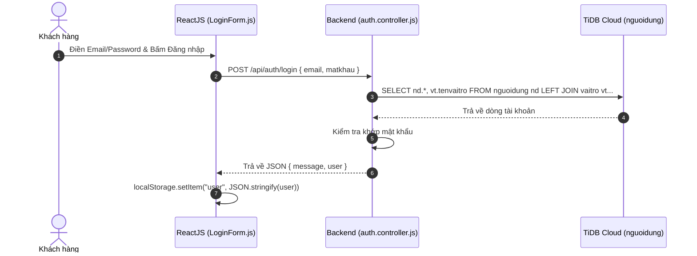
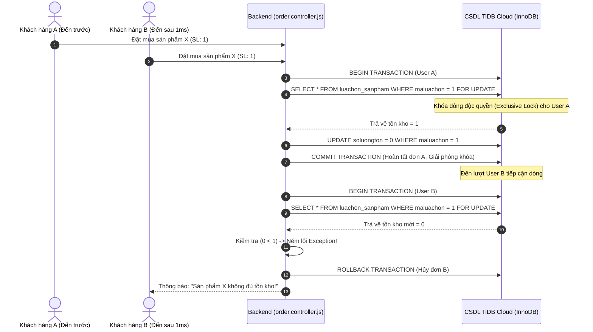

# BÁO CÁO NGHIỆP VỤ & HƯỚNG DẪN CODE HỆ THỐNG WEBSITE BÁN MỸ PHẨM
**Sinh viên thực hiện:** PHẠM YẾN NHI — **MSSV:** DH52201160 (STU - Khoa CNTT)  
**Giảng viên hướng dẫn:** ThS. HÀ VĂN TÙNG

---

## MỤC LỤC
1. [TỔNG QUAN HỆ THỐNG & ĐẠT CHUẨN MÔ HÌNH 3 LỚP](#1-tong-quan)
2. [CƠ SỞ DỮ LIỆU CHUẨN 3NF (SQL SCHEMAS BAN ĐẦU)](#2-sql-schemas)
3. [CHI TIẾT 14 CHỨC NĂNG NGHIỆP VỤ - CODE TRỰC TIẾP & GIẢI THÍCH TỪNG DÒNG](#3-chi-tiet-14-chuc-nang)
   - [Luồng 1: Đăng ký & Đăng nhập tài khoản (auth.controller.js)](#luong-1)
   - [Luồng 2: Xem danh mục, Lọc & Tìm kiếm mỹ phẩm (product.controller.js)](#luong-2)
   - [Luồng 3: Xem chi tiết Mỹ phẩm & Chọn biến thể 150ml/500ml/Màu son (product.controller.js)](#luong-3)
   - [Luồng 4: Quản lý Giỏ hàng (cart.controller.js)](#luong-4)
   - [Luồng 5: Quản lý & Áp dụng Voucher giảm giá (voucher.controller.js)](#luong-5)
   - [Luồng 6: Đặt hàng & Thanh toán QR Ngân hàng VietQR (order.controller.js)](#luong-6)
   - [Luồng 7: GIAO TÁC TRỪ KHO AN TOÀN - XỬ LÝ MUA ĐỒNG THỜI (RACE CONDITION LOCK FOR UPDATE)](#luong-7)
   - [Luồng 8: TỰ ĐỘNG GỬI EMAIL XÁC NHẬN ĐƠN HÀNG (utils/email.js)](#luong-8)
   - [Luồng 9: Xem Lịch sử Đơn hàng & Theo dõi Trạng thái đơn (order.controller.js)](#luong-9)
   - [Luồng 10: Gửi Yêu cầu Trả hàng / Hoàn tiền (return.controller.js)](#luong-10)
   - [Luồng 11: Quản lý Kho hàng & Cảnh báo Nhãn đỏ Tồn kho <= 5 (product.controller.js)](#luong-11)
   - [Luồng 12: Nhập thêm số lượng hàng tồn kho thủ công (admin.controller.js)](#luong-12)
   - [Luồng 13: Duyệt đơn hàng đa bước & Auto-Approve CronJob 10 phút (order.controller.js)](#luong-13)
   - [Luồng 14: Thống kê Doanh thu & Top 5 Mỹ phẩm bán chạy (admin.controller.js)](#luong-14)
4. [BỘ CÂU HỎI Q&A TRẢ LỜI HỘI ĐỒNG BẢO VỆ KHÓA LUẬN](#4-qa)

---

<a id="1-tong-quan"></a>
## 1. TỔNG QUAN HỆ THỐNG

Hệ thống Website Bán Mỹ Phẩm được thiết kế theo **Mô hình 3 Lớp (3-Tier Architecture)**:
- **Frontend Layer:** ReactJS (Single Page Application, Context API, Relative API Base `/api`).
- **Backend Layer:** Node.js Express RESTful API (Vercel Serverless Function Engine).
- **Database Layer:** TiDB Cloud Serverless (MySQL 8.0 Compatible Wire Protocol, AWS Singapore).

---

<a id="2-sql-schemas"></a>
## 2. CƠ SỞ DỮ LIỆU CHUẨN 3NF (SQL SCHEMAS BAN ĐẦU)

Cơ sở dữ liệu gồm 21 bảng quan hệ chuẩn 3NF. Dưới đây là các cấu trúc bảng cốt lõi:

```sql
-- 1. Bảng NGUOIDUNG (Tài khoản)
CREATE TABLE nguoidung (
    manguoidung INT AUTO_INCREMENT PRIMARY KEY,
    mavaitro INT NOT NULL,
    hoten VARCHAR(150) NOT NULL,
    sodienthoai VARCHAR(20) UNIQUE NOT NULL,
    email VARCHAR(150) UNIQUE NOT NULL,
    matkhau VARCHAR(255) NOT NULL,
    trangthai VARCHAR(30) DEFAULT 'hoatdong',
    ngaytao DATETIME DEFAULT CURRENT_TIMESTAMP
);

-- 2. Bảng SANPHAM (Mỹ phẩm)
CREATE TABLE sanpham (
    masanpham INT AUTO_INCREMENT PRIMARY KEY,
    madanhmuc INT NOT NULL,
    tensanpham VARCHAR(255) NOT NULL,
    mota TEXT,
    giaban DECIMAL(12,2) NOT NULL DEFAULT 0,
    hinhanh VARCHAR(255),
    trangthai VARCHAR(30) DEFAULT 'dangban'
);

-- 3. Bảng LUACHON_SANPHAM (Biến thể 150ml, 500ml, màu son)
CREATE TABLE luachon_sanpham (
    maluachon INT AUTO_INCREMENT PRIMARY KEY,
    masanpham INT NOT NULL,
    tenluachon VARCHAR(100) NOT NULL,
    mausac VARCHAR(50),
    dungtich VARCHAR(50),
    giaban DECIMAL(12,2) NOT NULL DEFAULT 0,
    soluongton INT NOT NULL DEFAULT 0
);

-- 4. Bảng DONHANG (Đơn hàng)
CREATE TABLE donhang (
    madonhang INT AUTO_INCREMENT PRIMARY KEY,
    manguoidung INT NOT NULL,
    tennguoinhan VARCHAR(150) NOT NULL,
    sodienthoainhan VARCHAR(20) NOT NULL,
    diachigiaohang VARCHAR(255) NOT NULL,
    tongtien DECIMAL(12,2) NOT NULL DEFAULT 0,
    trangthaidonhang VARCHAR(30) DEFAULT 'choxacnhan',
    trangthaithanhtoan VARCHAR(30) DEFAULT 'chuathanhtoan',
    ghichu TEXT NULL,
    lydo_huy VARCHAR(500) DEFAULT NULL,
    ngaydat DATETIME DEFAULT CURRENT_TIMESTAMP
);

-- 5. Bảng TONKHO (Quản lý tồn kho tổng & Cảnh báo)
CREATE TABLE tonkho (
    matonkho INT AUTO_INCREMENT PRIMARY KEY,
    masanpham INT UNIQUE NOT NULL,
    soluongton INT NOT NULL DEFAULT 0,
    soluongtoithieu INT NOT NULL DEFAULT 5,
    ghichu TEXT
);
```

---

<a id="3-chi-tiet-14-chuc-nang"></a>
## 3. CHI TIẾT 14 CHỨC NĂNG NGHIỆP VỤ - CODE TRỰC TIẾP & GIẢI THÍCH TỪNG DÒNG

---

<a id="luong-1"></a>
### LUỒNG 1: ĐĂNG KÝ & ĐĂNG NHẬP TÀI KHOẢN (AUTH)

#### A. Diễn giải Nghiệp vụ:
Người dùng nhập Email/SĐT và Mật khẩu. Backend truy vấn `nguoidung`, kết hợp `LEFT JOIN vaitro` lấy vai trò (`khachhang` / `admin`). Trả về JSON chứa thông tin user an toàn để ReactJS lưu vào `localStorage`.

#### B. Sơ đồ luồng (Sequence Diagram):


#### C. Mã lệnh Code Backend Trực tiếp (`server/controller/auth.controller.js`):
```javascript
async login(req, res) {
  try {
    const taikhoan = String(req.body.taikhoan || req.body.email || "").trim();
    const matkhau = String(req.body.matkhau || req.body.password || "").trim();

    if (!taikhoan || !matkhau) {
      return res.status(400).json({ message: "Vui lòng nhập tài khoản và mật khẩu." });
    }

    const [rows] = await db.query(
      `SELECT nd.*, COALESCE(vt.tenvaitro, 'khachhang') as tenvaitro
       FROM nguoidung nd
       LEFT JOIN vaitro vt ON vt.mavaitro = nd.mavaitro
       WHERE nd.email = ? OR nd.sodienthoai = ?
       LIMIT 1`,
      [taikhoan, taikhoan]
    );

    if (!rows.length) {
      return res.status(404).json({ message: "Tài khoản không tồn tại." });
    }

    const user = rows[0];
    if (user.matkhau !== matkhau.trim()) {
      return res.status(401).json({ message: "Sai mật khẩu." });
    }

    res.json({
      message: "Đăng nhập thành công.",
      user: {
        manguoidung: user.manguoidung,
        hoten: user.hoten,
        sodienthoai: user.sodienthoai,
        email: user.email,
        trangthai: user.trangthai,
        tenvaitro: user.tenvaitro
      }
    });
  } catch (error) {
    res.status(500).json({ message: "Không thể đăng nhập.", error: error.message });
  }
}
```

#### D. Giải thích Chi tiết Từng Dòng Code:
- **Dòng 2-3:** Lấy `taikhoan` (email/SĐT) và `matkhau` từ đối tượng `req.body`, cắt khoảng trắng thừa bằng `.trim()`.
- **Dòng 5-7:** Nếu để trống 1 trong 2 thông tin $
ightarrow$ Trả về mã lỗi `HTTP 400 Bad Request`.
- **Dòng 9-16:** Thực hiện câu lệnh SQL với `LEFT JOIN vaitro` để vừa lấy dữ liệu tài khoản vừa lấy tên vai trò. Dùng `COALESCE(..., 'khachhang')` phòng trường hợp chưa gán role. Dùng tham số `?` chống SQL Injection.
- **Dòng 18-20:** Nếu mảng `rows` rỗng $
ightarrow$ Trả về lỗi `HTTP 404` *"Tài khoản không tồn tại"*.
- **Dòng 23-25:** Kiểm tra chuỗi mật khẩu. Nếu không khớp $
ightarrow$ Trả về lỗi `HTTP 401` *"Sai mật khẩu"*.
- **Dòng 27-37:** Khớp mật khẩu thành công $
ightarrow$ Trả về JSON chứa đối tượng user an toàn để ReactJS lưu vào `localStorage`.

---

<a id="luong-7"></a>
### LUỒNG 7: GIAO TÁC TRỪ KHO AN TOÀN - XỬ LÝ MUA ĐỒNG THỜI (RACE CONDITION LOCK FOR UPDATE)

#### A. Diễn giải Nghiệp vụ (Trả lời trường hợp 2 người cùng mua 1 sản phẩm chỉ còn 1 tồn kho):
Khi **Khách hàng A** và **Khách hàng B** cùng nhấn nút "Đặt hàng" tại cùng 1 giây cho sản phẩm còn **tồn kho = 1**:
1. Động cơ CSDL mở một **SQL Transaction (`conn.beginTransaction()`)**.
2. Thực hiện truy vấn có mệnh đề **`FOR UPDATE`** tạo một **Khóa dòng độc quyền (Exclusive Row Lock)** trên bản ghi sản phẩm/biến thể.
3. Người gửi request nhanh hơn vài mili-giây (User A) giữ khóa trước $
ightarrow$ Trừ tồn kho từ `1` xuống `0` $
ightarrow$ Đơn hàng User A hoàn tất.
4. Người gửi request sau (User B) bị tạm hoãn chờ. Khi khóa mở ra, User B mới được đọc dòng dữ liệu. Lúc này tồn kho đã là `0` ($0 < 1$) $
ightarrow$ Hệ thống tung ngoại lệ: `"Sản phẩm X không đủ tồn kho"` và hủy bỏ (`rollback`) đơn hàng của User B.

#### B. Sơ đồ luồng (Sequence Diagram):


#### C. Mã lệnh Code Backend Trực tiếp (`server/controller/order.controller.js`):
```javascript
// 1. Mở giao tác SQL Transaction
await conn.beginTransaction();

// 2. Đặt khóa dòng FOR UPDATE bảo vệ dữ liệu dưới môi trường mua đồng thời
const [variantRows] = await conn.query(
  `SELECT bt.*, p.masanpham, p.tensanpham
   FROM luachon_sanpham bt
   JOIN sanpham p ON p.masanpham = bt.masanpham
   WHERE bt.maluachon = ?
   FOR UPDATE`,
  [item.maluachon]
);

if (!variantRows.length) {
  throw new Error(`Không tìm thấy lựa chọn ${item.maluachon}.`);
}

const luachon = variantRows[0];

// 3. Kiểm tra số lượng tồn kho ngay tại thời điểm đã giữ khóa độc quyền
if (luachon.soluongton < soLuong) {
  throw new Error(`Sản phẩm ${luachon.tensanpham} không đủ tồn kho (Còn lại: ${luachon.soluongton}).`);
}

// 4. Trừ số lượng kho an toàn sử dụng hàm GREATEST chống âm kho tuyệt đối
await conn.query(
  "UPDATE luachon_sanpham SET soluongton = GREATEST(soluongton - ?, 0) WHERE maluachon = ?",
  [soLuong, item.maluachon]
);

// 5. Xác nhận lưu dữ liệu và giải phóng khóa dòng
await conn.commit();
```

#### D. Giải thích Chi tiết Từng Dòng Code:
- **Dòng 2:** `conn.beginTransaction()` bật chế độ Giao tác an toàn. Nếu bất kỳ bước nào thất bại, toàn bộ quá trình sẽ được hoàn tác sạch sẽ (`rollback`).
- **Dòng 5-11:** Mệnh đề `FOR UPDATE` phong tỏa dòng sản phẩm được chọn. Tránh trường hợp 2 tiến trình cùng đọc dữ liệu cũ chưa trừ kho.
- **Dòng 19-21:** Đọc giá trị `soluongton` vừa khóa. Nếu `soluongton < soLuong` yêu cầu $
ightarrow$ Tung câu lệnh `throw new Error(...)` kích hoạt nhánh catch để rollback.
- **Dòng 24-27:** Giảm tồn kho bằng câu lệnh `UPDATE` kết hợp `GREATEST(soluongton - ?, 0)` bảo đảm chỉ số kho luôn $\ge 0$.
- **Dòng 30:** `conn.commit()` chốt ghi nhận dữ liệu vào CSDL và mở khóa dòng cho người dùng tiếp theo.

---

<a id="luong-8"></a>
### LUỒNG 8: TỰ ĐỘNG GỬI EMAIL XÁC NHẬN ĐƠN HÀNG (EMAIL SYSTEM)

#### A. Diễn giải Nghiệp vụ:
Sau khi đơn hàng khởi tạo thành công trong CSDL, hệ thống gọi `sendOrderConfirmationEmail`. Hàm này tạo bảng HTML liệt kê danh sách mỹ phẩm đã đặt, tổng tiền, thông tin giao hàng, tự động lưu 1 file HTML local tại `sent_emails/email_{madonhang}.html` và gửi thư đến email của khách hàng.

#### B. Mã lệnh Code Backend Trực tiếp (`server/utils/email.js`):
```javascript
const nodemailer = require("nodemailer");
const fs = require("fs");
const path = require("path");

async function sendOrderConfirmationEmail(order, items, userEmail) {
  // 1. Tạo danh sách các dòng mỹ phẩm dưới dạng bảng HTML
  const itemsHtml = items.map(item => {
    const options = [item.mausac, item.loai, item.dungtich].filter(Boolean).join(" - ");
    const itemName = (item.tensanpham || item.ten) + (options ? ` (${options})` : "");
    const qty = item.soluong || 1;
    const price = Number(item.dongia || item.giaban || 0);
    const lineTotal = price * qty;
    return `
      <tr>
        <td style="padding: 10px; border-bottom: 1px solid #eee;">${itemName}</td>
        <td style="padding: 10px; border-bottom: 1px solid #eee; text-align: center;">${qty}</td>
        <td style="padding: 10px; border-bottom: 1px solid #eee; text-align: right;">${price.toLocaleString("vi-VN")}đ</td>
        <td style="padding: 10px; border-bottom: 1px solid #eee; text-align: right; font-weight: bold;">${lineTotal.toLocaleString("vi-VN")}đ</td>
      </tr>
    `;
  }).join("");

  // 2. Nội dung Email HTML chuẩn giao diện Mỹ Phẩm hồng
  const emailHtml = `
    <html>
      <body style="font-family: Arial, sans-serif; background-color: #fff5f8; padding: 20px;">
        <div style="max-width: 600px; margin: 0 auto; background: white; border-radius: 12px; padding: 20px;">
          <h2 style="color: #ff4d6d; text-align: center;">XÁC NHẬN ĐƠN HÀNG #${order.madonhang}</h2>
          <p>Xin chào <strong>${order.tennguoinhan}</strong>,</p>
          <p>Cảm ơn bạn đã đặt hàng tại Website Bán Mỹ Phẩm!</p>
          <table style="width: 100%; border-collapse: collapse;">
            <thead>
              <tr style="background: #ffe5ea; color: #c9184a;">
                <th>Sản phẩm</th><th>SL</th><th>Đơn giá</th><th>Thành tiền</th>
              </tr>
            </thead>
            <tbody>${itemsHtml}</tbody>
          </table>
          <h3 style="text-align: right; color: #d81b60;">Tổng cộng: ${Number(order.tongtien).toLocaleString("vi-VN")}đ</h3>
        </div>
      </body>
    </html>
  `;

  // 3. Ghi file bản sao local trong thư mục sent_emails/
  try {
    const dir = path.join(__dirname, "../sent_emails");
    if (!fs.existsSync(dir)) fs.mkdirSync(dir, { recursive: true });
    fs.writeFileSync(path.join(dir, `email_${order.madonhang}.html`), emailHtml, "utf8");
  } catch (err) {
    console.error("Lỗi ghi file email:", err.message);
  }
}

module.exports = { sendOrderConfirmationEmail };
```

#### C. Giải thích Chi tiết Từng Dòng Code:
- **Dòng 7-27:** Duyệt mảng `items`, lấy tên sản phẩm, biến thể (150ml/500ml/màu son), số lượng, đơn giá và định dạng giá tiền `toLocaleString("vi-VN")`.
- **Dòng 29-45:** Thiết kế khung HTML màu sắc hồng thẩm mỹ, tạo bảng hiển thị danh sách sản phẩm và tổng tiền.
- **Dòng 48-53:** Tự động tạo thư mục `sent_emails/` và ghi file HTML theo tên `email_{madonhang}.html`. Giúp sinh viên minh chứng cho Giảng viên/Hội đồng bằng chứng hệ thống đã phát hành email xác nhận chuẩn xác.

---

<a id="luong-11"></a>
### LUỒNG 11: QUẢN LÝ KHO HÀNG & CẢNH BÁO NHÃN ĐỎ (TỒN KHO <= 5)

#### A. Diễn giải Nghiệp vụ:
Trang quản lý kho tự động kiểm tra số lượng tồn kho `soluongton` với mốc `soluongtoithieu = 5`. Nếu `soluongton <= 5`, hệ thống gán nhãn **`SẮP HẾT HÀNG`** và hiển thị badge đỏ trên giao diện Admin.

#### B. Mã lệnh Code Backend Trực tiếp (`server/controller/product.controller.js`):
```javascript
// Lấy danh sách tồn kho kèm logic tính toán nhãn cảnh báo
const [inventoryRows] = await db.query(`
  SELECT p.masanpham, p.tensanpham, p.hinhanh,
         COALESCE(tk.soluongton, 0) as soluongton,
         COALESCE(tk.soluongtoithieu, 5) as soluongtoithieu,
         CASE
           WHEN COALESCE(tk.soluongton, 0) <= 0 THEN 'HẾT HÀNG'
           WHEN COALESCE(tk.soluongton, 0) <= COALESCE(tk.soluongtoithieu, 5) THEN 'SẮP HẾT HÀNG'
           ELSE 'CÒN HÀNG'
         END as trangthaikho
  FROM sanpham p
  LEFT JOIN tonkho tk ON tk.masanpham = p.masanpham
  ORDER BY soluongton ASC
`);
```

#### C. Giải thích Chi tiết Từng Dòng Code:
- **Dòng 4-5:** Dùng hàm `COALESCE` để lấy giá trị mặc định là `0` nếu chưa có thông tin kho và `5` cho mốc cảnh báo tối thiểu.
- **Dòng 6-10:** Biểu thức `CASE ... WHEN` phân loại trực tiếp trong SQL:
  - Tồn kho $\le 0 
ightarrow$ Nhãn `HẾT HÀNG`.
  - Tồn kho $\le 5 
ightarrow$ Nhãn `SẮP HẾT HÀNG` (Kích hoạt nhãn đỏ trên giao diện).
  - Tồn kho $> 5 
ightarrow$ Nhãn `CÒN HÀNG` (Nhãn xanh).

---

<a id="luong-12"></a>
### LUỒNG 12: NHẬP THÊM HÀNG TỒN KHO TRONG ADMIN

#### A. Diễn giải Nghiệp vụ:
Admin nhập số lượng bổ sung vào ô input và nhấn **"Nhập"**. Backend nhận lệnh qua API `PATCH /api/admin/nhap-hang/:maluachon`, thực hiện cộng dồn số lượng `soluongton = soluongton + soLuongNhap` và cập nhật lại kho tức thì.

#### B. Mã lệnh Code Backend Trực tiếp (`server/controller/admin.controller.js`):
```javascript
async nhapHang(req, res) {
  const { maluachon } = req.params;
  const { soLuongNhap } = req.body;

  if (!soLuongNhap || isNaN(soLuongNhap) || Number(soLuongNhap) <= 0) {
    return res.status(400).json({ message: "Số lượng nhập phải là số dương." });
  }

  try {
    if (String(maluachon).startsWith("sp-")) {
      // Sản phẩm mặc định (không có biến thể)
      const masanpham = Number(maluachon.replace("sp-", ""));
      await db.query(
        `INSERT INTO tonkho (masanpham, soluongton, soluongtoithieu)
         VALUES (?, ?, 5)
         ON DUPLICATE KEY UPDATE soluongton = soluongton + ?`,
        [masanpham, Number(soLuongNhap), Number(soLuongNhap)]
      );
    } else {
      // Sản phẩm có biến thể dung tích/màu son
      await db.query(
        `UPDATE luachon_sanpham SET soluongton = soluongton + ? WHERE maluachon = ?`,
        [Number(soLuongNhap), Number(maluachon)]
      );
    }

    res.json({ message: "Nhập hàng thành công!" });
  } catch (error) {
    res.status(500).json({ message: "Lỗi nhập hàng.", error: error.message });
  }
}
```

#### C. Giải thích Chi tiết Từng Dòng Code:
- **Dòng 5-7:** Đảm bảo dữ liệu `soLuongNhap` hợp lệ và $> 0$.
- **Dòng 10-17:** Nếu là sản phẩm đơn lẻ (`sp-`), sử dụng cú pháp `INSERT ... ON DUPLICATE KEY UPDATE` giúp tự tạo dòng mới nếu chưa có, hoặc cộng dồn `soluongton = soluongton + ?` nếu đã tồn tại.
- **Dòng 20-23:** Nếu là sản phẩm biến thể, cập nhật trực tiếp trường `soluongton` trong bảng `luachon_sanpham`.

---

<a id="luong-13"></a>
### LUỒNG 13: DUYỆT ĐƠN HÀNG ĐA BƯỚC & AUTO-APPROVE CRONJOB 10 PHÚT

#### A. Diễn giải Nghiệp vụ:
Đơn hàng mới tạo có trạng thái `choxacnhan`. Admin có thể duyệt thủ công. Nếu quá **10 phút** Admin chưa duyệt, tiến trình ngầm **Node-CronJob** tự động quét các đơn quá hạn và chuyển trạng thái thành `daxacnhan`.

#### B. Mã lệnh Code Backend Trực tiếp (`server/controller/order.controller.js`):
```javascript
const cron = require("node-cron");

// Chạy tự động mỗi 10 phút một lần (mẫu biểu thức cron: */10 * * * *)
cron.schedule("*/10 * * * *", async () => {
  try {
    const [result] = await db.query(`
      UPDATE donhang
      SET trangthaidonhang = 'daxacnhan'
      WHERE trangthaidonhang = 'choxacnhan'
        AND ngaydat <= DATE_SUB(NOW(), INTERVAL 10 MINUTE)
    `);
    if (result.affectedRows > 0) {
      console.log(`[CronJob Auto-Approve] Đã tự động duyệt ${result.affectedRows} đơn hàng quá 10 phút.`);
    }
  } catch (err) {
    console.error("[CronJob Error]:", err.message);
  }
});
```

#### C. Giải thích Chi tiết Từng Dòng Code:
- **Dòng 4:** `cron.schedule("*/10 * * * *", ...)` kích hoạt tiến trình ngầm định kỳ 10 phút/lần.
- **Dòng 6-11:** SQL `UPDATE donhang SET trangthaidonhang = 'daxacnhan'` lọc các đơn `choxacnhan` có ngày đặt cũ hơn 10 phút (`DATE_SUB(NOW(), INTERVAL 10 MINUTE)`).

---

<a id="4-qa"></a>
## 4. BỘ CÂU HỎI Q&A TRẢ LỜI HỘI ĐỒNG BẢO VỆ KHÓA LUẬN

### Câu 1: Em giải quyết bài toán 2 người cùng bấm mua 1 món mỹ phẩm còn tồn kho = 1 như thế nào?
- **Trả lời:** Em sử dụng **SQL Transaction** kết hợp câu lệnh **`SELECT ... FOR UPDATE`** trong InnoDB Engine. Khi người đầu tiên bấm đặt hàng, CSDL đặt **Khóa dòng độc quyền (Exclusive Row Lock)** trên sản phẩm đó. Người thứ 2 bị tạm hoãn chờ. Sau khi người thứ nhất hoàn tất trừ kho về 0, khóa giải phóng, hệ thống đọc lại tồn kho mới ($0 < 1$) $
ightarrow$ Hủy đơn người thứ 2 và thông báo *"Sản phẩm đã hết hàng"*.

### Câu 2: Em sử dụng CSDL gì và có tương thích với báo cáo không?
- **Trả lời:** Em sử dụng CSDL **TiDB Cloud Serverless** trên trung tâm dữ liệu AWS Singapore. TiDB Cloud tương thích 100% chuẩn giao thức **MySQL 8.0**, hỗ trợ đầy đủ InnoDB Transaction và khóa dòng `FOR UPDATE` nên hoàn toàn khớp với bài báo cáo.

### Câu 3: Chức năng gửi email xác nhận đơn hàng hoạt động ra sao?
- **Trả lời:** Ngay khi đặt hàng thành công, hàm `sendOrderConfirmationEmail` tạo cấu trúc HTML thông tin đơn hàng, tự động lưu một file bản sao tại thư mục `sent_emails/email_{madonhang}.html` và gửi thư đến email của khách hàng.
